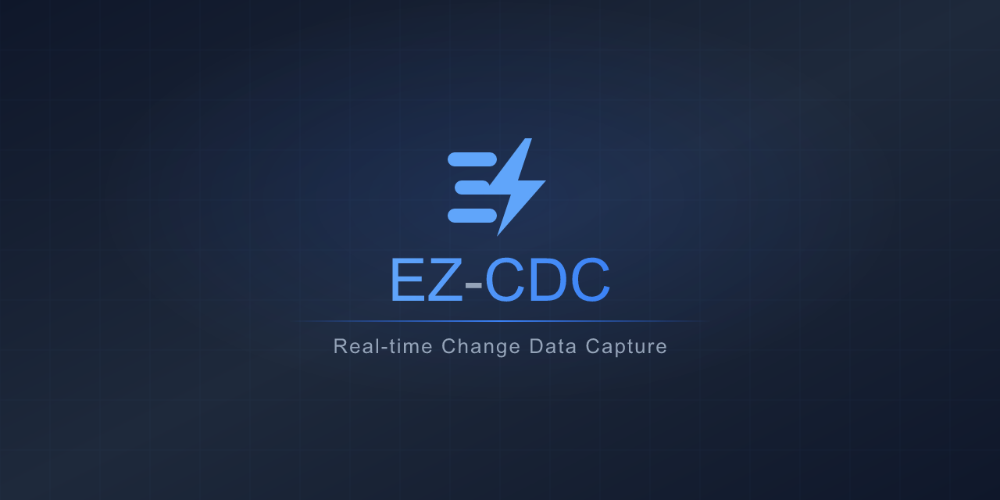

<div align="center">

<a href="https://ez-cdc.com" target="_blank">
  
</a>

<br>

**Real-time data replication, radically simplified**

Sub-second latency · 5 MB memory · Zero config · One binary · Written in Rust

[](LICENSE)
[](https://github.com/ez-cdc/dbmazz/pkgs/container/dbmazz)

[Install the CLI](#-install-the-cli) · [Quickstart](#-quickstart) · [Run in production](#-run-in-production) · [Why dbmazz?](#why-dbmazz) · [Performance](#performance) · [EZ-CDC Cloud](#️-scale-with-ez-cdc-cloud) · [Reference](#-reference)

</div>

---

## 📦 Install the CLI

One-liner installer — no Rust toolchain, no clone, no compile:

```bash
curl -sSL https://raw.githubusercontent.com/ez-cdc/dbmazz/main/install.sh | sh
```

Supports Linux and macOS on both amd64 and arm64. The binary is
downloaded from the latest GitHub release, checksum-verified, and
installed to `$HOME/.local/bin/ez-cdc` (or `/usr/local/bin` with sudo).

Pin a specific version or change the install dir with:

```bash
EZ_CDC_VERSION=v1.5.2 curl -sSL .../install.sh | sh
EZ_CDC_INSTALL_DIR=/opt/bin curl -sSL .../install.sh | sh
```

---

## 🚀 Quickstart

Launch a live CDC dashboard in 2 commands:

```bash
ez-cdc datasource init                                      # create demo config
ez-cdc quickstart --source demo-pg --sink demo-starrocks    # start everything + dashboard
```

`quickstart` pulls the official `ghcr.io/ez-cdc/dbmazz` image from
GHCR, starts the infra containers, runs snapshot + CDC replication,
and opens a live terminal dashboard showing throughput, lag, and
source/target row counts in real time. Press `t` to generate traffic,
`q` to quit.

> Docker must be running. StarRocks takes ~60s to initialize on first
> run. To test a patched daemon locally, set `DBMAZZ_IMAGE=my-tag:dev`
> before running `ez-cdc`.

### Use your own databases

Run the daemon directly with Docker and configure everything from the
web UI at `http://localhost:8080`:

```bash
docker run -d --name dbmazz \
  -p 8080:8080 -p 50051:50051 \
  ghcr.io/ez-cdc/dbmazz:latest
```

A setup wizard lets you test connections, discover tables, and start
replication with one click. No config files needed. See
[`docs/configuration.md`](docs/configuration.md) for the full list of
environment variables if you prefer to configure via env vars.

---

## 🐳 Run in production

The production path is a Docker container with pinned version,
restart policy, and secrets in an env file:

```bash
docker run -d \
  --name dbmazz \
  --restart unless-stopped \
  -p 8080:8080 -p 50051:50051 \
  --env-file /etc/dbmazz/env \
  ghcr.io/ez-cdc/dbmazz:1.5.2
```

See [`docs/production-deployment.md`](docs/production-deployment.md)
for full guidance on Docker Compose, AWS ECS Fargate, secrets
management, Prometheus monitoring, and operations (pause/resume/drain).

Running multiple pipelines? Need HA, auto-healing, and a web portal?
See [EZ-CDC Cloud](https://ez-cdc.com).

---

## 🧪 Test a sink end-to-end

The `ez-cdc` CLI provides a single entry point for running the full
e2e validation suite against any supported sink. It verifies snapshot,
CDC (INSERT/UPDATE/DELETE), TOAST handling, schema consistency, and
more — see [`docs/contributing-connectors.md`](docs/contributing-connectors.md)
for the full list of checks.

### Supported sinks

| Sink | Demo datasource | Requirements |
|------|----------------|--------------|
| StarRocks | `demo-starrocks` | Docker only |
| PostgreSQL | `demo-pg-target` | Docker only |
| Snowflake | (add via wizard) | Snowflake account |

### Run verify

```bash
ez-cdc verify --source demo-pg --sink demo-starrocks          # full verification suite
ez-cdc verify --source demo-pg --sink demo-pg-target          # PG target
ez-cdc verify --source demo-pg --sink demo-starrocks --quick  # skip slow checks (TOAST, idempotency)
```

### Snowflake

Snowflake is cloud-only — no Docker container. Add credentials interactively
with `ez-cdc datasource add`, or edit `ez-cdc.yaml` directly. Free 30-day
trial at [signup.snowflake.com](https://signup.snowflake.com).

### Other commands

```bash
ez-cdc up                                                # start all infra containers
ez-cdc down                                              # stop all infra containers
ez-cdc logs                                              # tail infra logs
ez-cdc clean --source demo-pg --sink demo-starrocks      # clean target DB
ez-cdc status                                            # one-shot daemon status
ez-cdc datasource list                                   # show configured datasources
ez-cdc datasource add                                    # interactive wizard
ez-cdc --help                                            # see everything
```

> Adding a new sink? See [`e2e-cli/README.md`](e2e-cli/README.md) and
> [`docs/contributing-connectors.md`](docs/contributing-connectors.md)
> for the step-by-step checklist.

---

## Why dbmazz?

Other CDC tools need Kafka, ZooKeeper, JVM clusters, or multi-container orchestration. dbmazz is a single binary — download, run, replicate.

|  |  |
|--|--|
| ⚡ **Fast** | 300K+ events/sec. Sub-second replication lag. |
| 🪶 **Tiny** | ~5 MB memory footprint. Runs on the smallest EC2 instance or a Raspberry Pi. |
| 🚀 **Simple** | One binary, zero dependencies. No Kafka, no JVM, no cluster. Up and running in minutes. |
| 🔒 **Reliable** | At-least-once delivery via LSN checkpointing. No data loss. |
| 📸 **Snapshot** | Backfill existing data with zero downtime — runs concurrently with CDC. |
| 🔧 **Zero config** | Auto-creates publications, replication slots, sink tables, and audit columns. |
| 📊 **Observable** | Built-in dashboard, Prometheus metrics, and gRPC API out of the box. |

### Supported databases

| Source | Sink | Status |
|:-------|:-----|:-------|
| PostgreSQL | StarRocks | Stable |
| PostgreSQL | PostgreSQL | In development |
| PostgreSQL | Snowflake | In development |

MongoDB, S3, and more on the [roadmap](.plans/multi-sink-roadmap.md).

---

## Performance

### CDC Replication

dbmazz reads the PostgreSQL WAL directly and streams changes to StarRocks. Single binary, no JVM, no Kafka, no intermediate queues.

```
  Throughput   ████████████████████████████████████████  300,000+ events/sec
  Latency      █                                        < 1 second
  Memory       ▏                                        ~ 5 MB
  CPU          ▏                                        < 2%
```

|  | dbmazz | Traditional CDC tools |
|:--|:--:|:--|
| **Runtime** | Single binary (5 MB RSS) | JVM + Kafka + ZooKeeper, or managed SaaS |
| **Deployment** | One process, zero dependencies | Multi-container orchestration |
| **Scaling model** | Vertical (one instance per job) | Horizontal (brokers, connectors, workers) |

---

### Snapshot (Initial Backfill)

Snapshot loads all existing rows before CDC takes over. It runs concurrently with the WAL consumer — no downtime, no data loss.

<table>
<tr><td>

**Test environment** — TPC-DS 1TB (25 tables, 6.35 billion rows)

| | |
|--|--|
| **Source** | PostgreSQL 16 — AWS RDS `db.r6i.2xlarge` (8 vCPU, 64 GB) |
| **Worker** | EC2 `c6i.4xlarge` (16 vCPU, 32 GB) — same AZ |
| **Storage** | gp3 (3,000 baseline IOPS, burst to 16,000) |

</td></tr>
</table>

| Workers | Chunk size | Narrow tables | Wide tables | Worker CPU | Worker RAM |
|:-------:|:----------:|---------------:|-------------:|:----------:|:----------:|
| 6 | 150K | **130K rows/s** | 11K rows/s | 25–35% | ~2 GB |
| 12 | 200K | **107K rows/s** | 22K rows/s | 60% | ~2 GB |
| 20 | 50K | 93K rows/s | 15K rows/s | 87–97% | ~2 GB |

<sup>Narrow: `catalog_returns` (27 cols, 144M rows). Wide: `catalog_sales` (34 cols, 1.44B rows).</sup>

> **Where's the bottleneck?** On wide tables the worker sits idle at 3–7% CPU while RDS DiskQueueDepth hits 12 and ReadIOPS maxes at 12,000. The bottleneck is PostgreSQL disk I/O, not the CDC tool. Every CDC tool that reads from PostgreSQL hits this same ceiling.

---

## ☁️ Scale with EZ-CDC Cloud

dbmazz is the open-source CDC engine at the core of **<a href="https://ez-cdc.com" target="_blank">EZ-CDC</a>**. It's fast, reliable, and free to use.

But running CDC in production means managing multiple jobs, monitoring them, handling failures, and keeping everything running 24/7. That's what EZ-CDC Cloud does.

|  | **dbmazz** (open source) | **EZ-CDC Cloud** |
|--|--------------------------|-------------------|
| **Engine** | Full CDC engine (this repo) | Same engine, fully managed |
| **Jobs** | 1 instance = 1 job | Unlimited jobs, one dashboard |
| **Deployment** | You build, deploy, maintain | BYOC — deploys in your AWS/GCP via Terraform |
| **Availability** | Manual restarts | Auto-healing workers, zero downtime |
| **Monitoring** | Per-instance dashboard | Centralized metrics, alerting, historical dashboards |
| **Security** | You manage credentials | AES-256 encryption, RBAC, audit logs, API keys |
| **Web portal** | Status page at `:8080` | Full management portal for your team |
| **API** | HTTP + gRPC per instance | REST API + MCP server (Claude, Cursor) |
| **Support** | GitHub Issues | Enterprise SLAs |
| **Cost** | Free | Pay per deployment |

### When to use dbmazz

- Single PostgreSQL → StarRocks pipeline
- You're comfortable managing the process yourself
- You want to embed the CDC engine in your own tooling

### When to use EZ-CDC

- Multiple replication jobs across databases
- Zero-downtime with auto-healing and restarts
- Centralized observability for all jobs
- BYOC deployment with Terraform automation
- Web portal for your team — no CLI needed
- Enterprise security — encrypted configs, RBAC, API keys

<p align="center">
  <br>
  <a href="https://ez-cdc.com" target="_blank"><strong>Get started with EZ-CDC Cloud →</strong></a>
  <br><br>
</p>

---

## 📖 Reference

<details>
<summary><strong>🐳 Docker deployment</strong></summary>

The official image is published on every release to
[GitHub Container Registry](https://github.com/ez-cdc/dbmazz/pkgs/container/dbmazz):

```bash
docker pull ghcr.io/ez-cdc/dbmazz:1.5.2   # pin to exact version
docker pull ghcr.io/ez-cdc/dbmazz:1.5     # latest patch of 1.5
docker pull ghcr.io/ez-cdc/dbmazz:1       # latest minor of 1
docker pull ghcr.io/ez-cdc/dbmazz:latest  # latest stable (avoid for prod)
```

The image is multi-arch (`linux/amd64` + `linux/arm64`), runs as
non-root, and ships with the web UI, Prometheus metrics, and gRPC
control plane enabled by default.

For local dev and e2e testing, the `ez-cdc` CLI wraps Docker Compose
to spin up source + sinks + dbmazz together:

```bash
ez-cdc up       # start all infra containers (source PG + sinks)
ez-cdc down     # stop and destroy all containers + volumes
```

See [`docs/production-deployment.md`](docs/production-deployment.md)
for full deployment guidance (Compose, ECS, secrets, monitoring).

</details>

<details>
<summary><strong>⚙️ Configuration</strong></summary>

Configured via environment variables. See [`docs/configuration.md`](docs/configuration.md) for a full reference with all variables organized by section.

With the HTTP API enabled (default), all connection variables are optional — you can configure everything from the browser instead.

| Variable | Default | Description |
|----------|---------|-------------|
| `SOURCE_URL` | — | PostgreSQL connection string (`?replication=database` required) |
| `SOURCE_SLOT_NAME` | `dbmazz_slot` | Logical replication slot name |
| `SOURCE_PUBLICATION_NAME` | `dbmazz_pub` | Publication name |
| `TABLES` | `orders,order_items` | Comma-separated list of tables to replicate |
| `SINK_URL` | — | StarRocks FE HTTP URL (e.g. `http://starrocks:8030`) |
| `SINK_PORT` | `9030` | StarRocks FE MySQL port |
| `SINK_DATABASE` | — | Target database in StarRocks |
| `SINK_USER` | `root` | StarRocks user |
| `SINK_PASSWORD` | *(empty)* | Sink password |
| `SINK_SNOWFLAKE_ACCOUNT` | — | Snowflake account identifier (e.g. `xy12345.us-east-1`) |
| `SINK_SNOWFLAKE_WAREHOUSE` | — | Snowflake warehouse for COPY/MERGE |
| `SINK_SNOWFLAKE_ROLE` | *(empty)* | Snowflake role (optional) |
| `SINK_SNOWFLAKE_PRIVATE_KEY_PATH` | *(empty)* | Path to RSA key for JWT auth (optional) |
| `SINK_SNOWFLAKE_SOFT_DELETE` | `true` | Soft delete mode (`true`/`false`) |
| `FLUSH_SIZE` | `10000` | Max events per batch |
| `FLUSH_INTERVAL_MS` | `5000` | Max ms before flushing a batch |
| `GRPC_PORT` | `50051` | gRPC server port |
| `HTTP_API_PORT` | `8080` | HTTP API port (`--features http-api`) |
| `RUST_LOG` | `info` | Log level |
| `DO_SNAPSHOT` | `false` | Enable initial snapshot/backfill of existing data |
| `SNAPSHOT_CHUNK_SIZE` | `50000` | Rows per snapshot chunk (min: 1) |
| `SNAPSHOT_PARALLEL_WORKERS` | `2` | Reserved for future use (currently sequential) |

</details>

<details>
<summary><strong>🌐 HTTP API</strong></summary>

Build with `--features http-api` to enable the web UI and HTTP endpoints.

| Method | Path | Description |
|--------|------|-------------|
| GET | `/` | Web UI (setup wizard or live dashboard) |
| GET | `/healthz` | Health check |
| GET | `/status` | Full metrics JSON |
| GET | `/metrics/prometheus` | Prometheus metrics |
| POST | `/pause` | Pause replication |
| POST | `/resume` | Resume replication |
| POST | `/drain-stop` | Graceful drain and stop |
| POST | `/api/datasources/test` | Test connection |
| POST | `/api/tables/discover` | Discover tables |
| POST | `/api/replication/start` | Start replication |
| POST | `/api/replication/stop` | Stop replication |

```bash
curl http://localhost:8080/healthz
curl -X POST http://localhost:8080/pause
curl -X POST http://localhost:8080/resume
```

</details>

<details>
<summary><strong>📸 Snapshot / Backfill</strong></summary>

Snapshot loads all existing rows from PostgreSQL into StarRocks before CDC takes over. It runs concurrently with the WAL consumer — no downtime, no data loss.

### Enable on startup

Set `DO_SNAPSHOT=true` to run a full snapshot when the daemon starts:

```bash
DO_SNAPSHOT=true SNAPSHOT_CHUNK_SIZE=50000 ./target/release/dbmazz
```

The snapshot divides each table into PK-range chunks and processes them sequentially. Progress is tracked in a `dbmazz_snapshot_state` table in PostgreSQL, so interrupted snapshots resume from the last completed chunk.

### Trigger on-demand (via gRPC)

You can trigger a snapshot at any time while CDC is running:

```bash
grpcurl -plaintext -d '{}' localhost:50051 dbmazz.CdcControlService/StartSnapshot
```

### How it works

Uses the [Flink CDC concurrent snapshot algorithm](https://nightlies.apache.org/flink/flink-docs-stable/docs/connectors/table/jdbc/#scan-incremental-snapshot):

1. For each chunk: emit low-watermark (LW) → SELECT rows → emit high-watermark (HW) → Stream Load to StarRocks
2. The WAL consumer checks `should_emit()` for each event — events within a completed chunk's PK range with LSN <= HW are suppressed (already loaded by snapshot)
3. Events outside chunk ranges or with LSN > HW are emitted normally

This ensures consistent delivery even with concurrent writes during the snapshot.

### Monitor progress

```bash
grpcurl -plaintext -d '{}' localhost:50051 dbmazz.CdcStatusService/GetStatus
# snapshot_active: true, snapshot_chunks_total: 100, snapshot_chunks_done: 42, snapshot_rows_synced: 21000000
```

</details>

<details>
<summary><strong>🔌 gRPC API</strong></summary>

gRPC with reflection enabled — `grpcurl` works without `.proto` files.

```bash
grpcurl -plaintext localhost:50051 dbmazz.HealthService/Check
grpcurl -plaintext -d '{"interval_ms": 2000}' localhost:50051 dbmazz.CdcMetricsService/StreamMetrics
grpcurl -plaintext -d '{}' localhost:50051 dbmazz.CdcControlService/Pause
grpcurl -plaintext -d '{}' localhost:50051 dbmazz.CdcControlService/Resume
grpcurl -plaintext -d '{}' localhost:50051 dbmazz.CdcControlService/StartSnapshot
```

</details>

<details>
<summary><strong>🏗️ Architecture</strong></summary>

```
PostgreSQL (source)            dbmazz                         Sink (target)
┌──────────────┐            ┌──────────────────┐          ┌──────────────┐
│  WAL         │  logical   │ WAL Handler      │          │ StarRocks    │
│  (INSERT,    │  replic.   │   ▼              │          │ PostgreSQL   │
│   UPDATE,    │ ─────────▶ │ CdcRecord        │  write   │ Snowflake    │
│   DELETE)    │ (pgoutput) │   ▼              │──batch──▶│ ...          │
│              │            │ Pipeline         │          │              │
│              │ ◀──────────│ Checkpoint (LSN) │          │              │
└──────────────┘  confirm   └──────────────────┘          └──────────────┘
                                 ~5 MB RAM                     <1s lag
```

dbmazz reads the PostgreSQL Write-Ahead Log via logical replication, converts events to generic `CdcRecord` types, batches them in a pipeline, and writes to any supported sink via the `Sink` trait. Each instance handles one replication job.

The sink is fully responsible for its loading strategy (Stream Load, COPY, S3 staging, etc.). The engine and pipeline are sink-agnostic.

See [docs/architecture.md](docs/architecture.md) for the full data flow, module map, and how to add new sinks.

</details>

<details>
<summary><strong>🔨 Build from source</strong></summary>

```bash
cargo build --release       # Default build: all 3 sinks + HTTP API + web UI
```

For an extra-minimal binary without the HTTP API:

```bash
cargo build --release --no-default-features \
  --features "sink-starrocks,sink-postgres,sink-snowflake,grpc-reflection"
```

</details>


---

## 🤝 Contributing

See [CONTRIBUTING.md](CONTRIBUTING.md) for general guidelines and [docs/contributing-connectors.md](docs/contributing-connectors.md) for adding new connectors.

## 📄 License

[Elastic License v2.0](LICENSE) — free for commercial and non-commercial use. Cannot be offered as a managed service.
